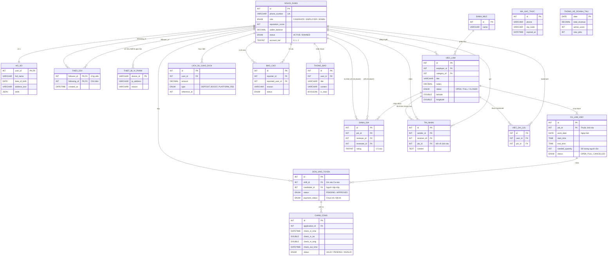

# Sơ đồ JobNow ERD (Mermaid)

Dưới đây là sơ đồ Thực thể - Mối quan hệ (ERD) hoàn chỉnh của hệ thống JobNow, được tạo tự động bằng cú pháp Mermaid. Sơ đồ mô tả 16 bảng dữ liệu cốt lõi chia thành 4 phân hệ chính:

