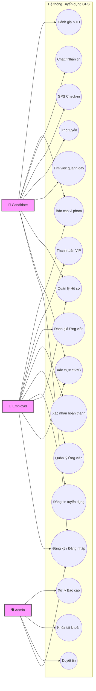

# Biểu đồ Use Case (Ca sử dụng)

Biểu đồ dưới đây mô tả tổng quan các chức năng của hệ thống và sự tương tác của các tác nhân (Actors).

## 1. Các Tác nhân (Actors)
*   **Candidate (Người tìm việc):** Người lao động thời vụ, sinh viên.
*   **Employer (Nhà tuyển dụng):** Gồm Cá nhân (Hộ gia đình) và Doanh nghiệp.
*   **Admin (Quản trị viên):** Người vận hành hệ thống.
*   **System (Hệ thống - Time):** Các tác vụ tự động (Bộ lọc, Notify).

## 2. Biểu đồ Use Case Tổng quát

## 3. Mô tả chi tiết các nhóm chức năng

### Nhóm Candidate (Người tìm việc)
*   **Tìm việc quanh đây:** Hệ thống tự động lấy GPS của Candidate để hiển thị các Job Pin trên bản đồ.
*   **GPS Check-in:** Bắt buộc phải có mặt tại phạm vi bán kính 200m quanh địa điểm làm việc mới bấm được nút Check-in.

### Nhóm Employer (Nhà tuyển dụng)
*   **Đăng tin:** Phải chọn toa độ trên bản đồ. Nếu chọn loại việc "Remote/Online", hệ thống sẽ vô hiệu hóa yêu cầu GPS Check-in.
*   **Xác thực eKYC:** Bắt buộc để nhận tích xanh và tăng giới hạn đăng tin.

### Nhóm Admin
*   **Giải quyết Báo cáo:** Xem bằng chứng (hoặc kết quả AI trả về) để quyết định Trừ điểm uy tín hoặc Khóa tài khoản.
