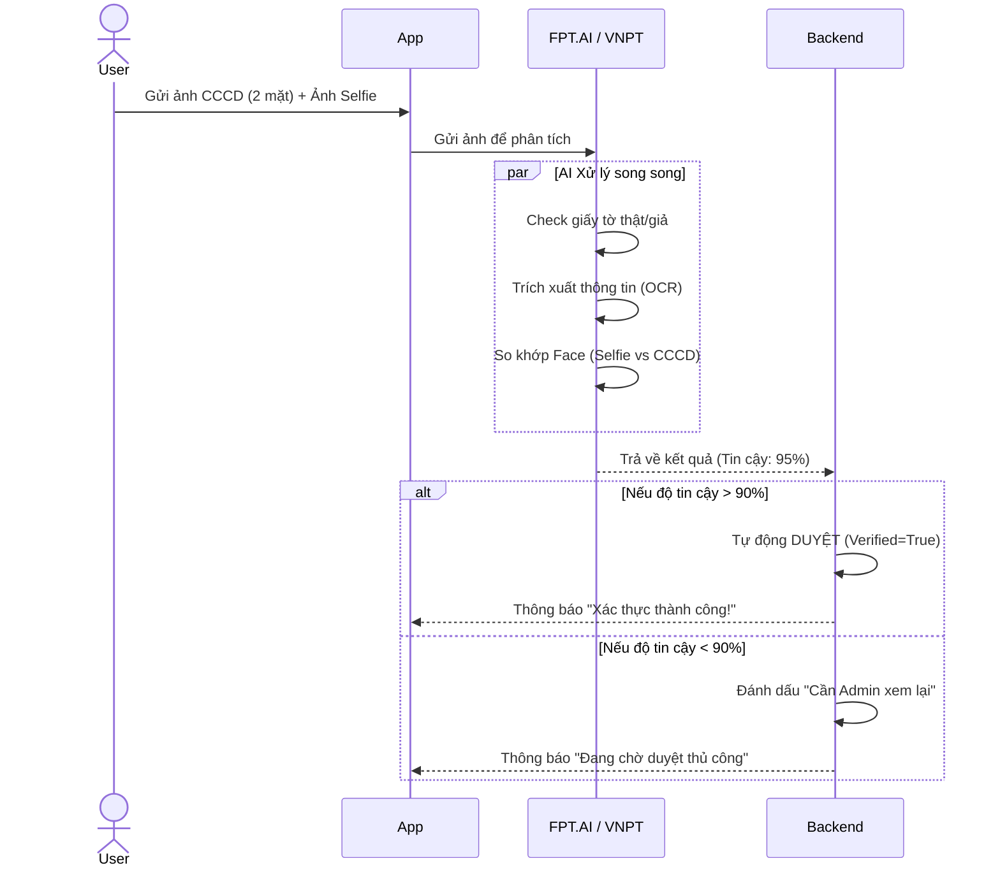

# Giải pháp eKYC: Ngăn chặn Gian lận & Đảm bảo An toàn

Để trả lời câu hỏi "Làm sao app mình chặn được người xấu/lừa đảo?", chúng ta sử dụng quy trình **eKYC (Định danh điện tử)** kết hợp với **AI (Trí tuệ nhân tạo)**.

## 1. Nguyên lý hoạt động (Cốt lõi)
Thay vì để Admin ngồi soi bằng mắt thường (vừa chậm vừa dễ sót), App sẽ tích hợp **API của bên thứ 3** (như FPT.AI, VNPT, Amazon Rekognition).

**Quy trình 3 bước chặn đứng gian lận:**
1.  **Bước 1 - Chống Giấy tờ giả (OCR & Fake Check):**
    *   AI quét ảnh CCCD/CMND để phát hiện dấu hiệu chỉnh sửa, cắt ghép photoshop.
    *   Tự động trích xuất Tên, Số CCCD (Người dùng không tự nhập tay được -> Tránh khai gian).
2.  **Bước 2 - Chống Người giả (Liveness Detection):**
    *   Yêu cầu người dùng quay video hoặc chụp ảnh Selfie cử động (nghiêng đầu, chớp mắt).
    *   Mục đích: Đảm bảo người đang cầm điện thoại là **người thật**, không phải là ảnh chụp lại từ màn hình khác hay video quay sẵn (Deepfake).
3.  **Bước 3 - So khớp khuôn mặt (Face Matching):**
    *   AI so sánh khuôn mặt trong ảnh Selfie với ảnh trên CCCD.
    *   Nếu độ trùng khớp < 90% -> Từ chối ngay lập tức.

## 2. Áp dụng cho từng đối tượng

### 2.1. Với Nhà tuyển dụng (BẮT BUỘC)
Đây là đối tượng dễ gây ra lừa đảo nhất (thu phí, việc ảo).
*   **Quy định:** Bắt buộc 100% phải eKYC mới được đăng bài.
*   **Hiệu quả:**
    *   Nếu lừa đảo -> Bị Report -> Hệ thống khóa tài khoản vĩnh viễn và lưu lại Số CCCD/Khuôn mặt vào **Blacklist**.
    *   Kẻ lừa đảo không thể lập nick mới vì CCCD và Khuôn mặt đã bị cấm.

### 2.2. Với Ứng viên (KHUYẾN KHÍCH)
*   **Quy định:** Không bắt buộc, nhưng nếu làm sẽ được tặng huy hiệu **"Verified" (Tích xanh)**.
*   **Lợi ích:** Được các Chủ quán tin tưởng giao việc, đặc biệt là các việc nhạy cảm (giao hàng giá trị cao, dọn dẹp nhà cửa).

## 3. Kịch bản xử lý (Workflow)

## 4. Chi phí dự kiến (Lưu ý cho Startup)
*   Các dịch vụ AI thường tính phí theo lượt (khoảng 1.000đ - 3.000đ / lượt check).
*   **Chiến lược:** Chỉ gọi API khi người dùng thực sự muốn đăng tin hoặc rút tiền để tiết kiệm chi phí ban đầu.

---

## 5. Bảo mật Thông tin Khách hàng (Cực kỳ quan trọng)

Việc lưu trữ CCCD là "con dao hai lưỡi". Nếu bị lộ, uy tín dự án sẽ sụp đổ. Để giải quyết lo ngại này, ta áp dụng 3 lớp bảo vệ:

### 5.1. Không lưu trực tiếp ảnh CCCD lên Web Server
*   **Tuyệt đối KHÔNG** lưu file ảnh (jpg, png) trong thư mục code của web server.
*   **Giải pháp:** Lưu trên **Cloud Storage (AWS S3, Google Cloud Storage)** ở chế độ **Private**.
*   Ảnh chỉ có thể truy cập bằng một đường link tạm thời (Signed URL) tồn tại trong 5 phút. Hết 5 phút đường link đó chết -> Hacker có lấy được link cũng không xem được.

### 5.2. Mã hóa dữ liệu (Encryption)
*   Dữ liệu nhạy cảm như *Số CCCD, Họ tên thật, Ngày sinh* trong Database sẽ được mã hóa (AES-256).
*   Kể cả nhân viên IT hay Admin vào xem Database cũng chỉ thấy một chuỗi ký tự loằng ngoằng, không đọc được nội dung gốc.

### 5.3. Tuân thủ Nghị định 13/2023/NĐ-CP (Bảo vệ dữ liệu cá nhân)
*   Hiển thị rõ **Chính sách riêng tư** khi người dùng bắt đầu Upload.
*   Cam kết: "Dữ liệu này chỉ dùng duy nhất cho mục đích xác thực danh tính, không chia sẻ cho bên thứ 3 nào khác".
*   Cho phép người dùng yêu cầu **Xóa dữ liệu** nếu họ muốn đóng tài khoản.
